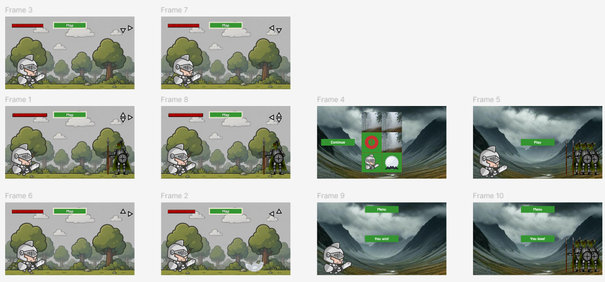
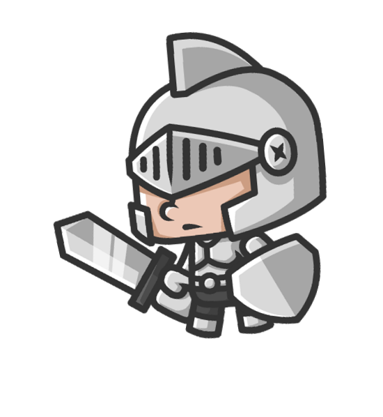
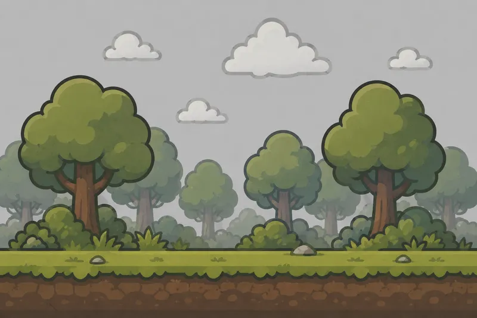
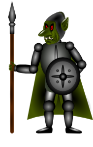

# Пакет разработки игры

## 1. Краткий бриф

**Название:** Heroes of Timerion Valley

**Жанр и камера:** 2D survival-explore, вид сбоку.

**Одно предложение:** Игрок управляет воином, чтобы изучить загадочную долину, но ему мешают злые гоблины.

**Платформа:** Мобильная

**Экран:** 16:9

**Управление:** touch

**Игровая цель:**
При достижении цели (открытии всех тайлов) фон сменяется на победный, где прямо в центре написано оповещение "You win!".

**Сеттинг и тон:**
Действие происходит в магической Долине Тимериона, атмосфера гнетущая, в Долине всегда пасмурно.

## 2. MVP

**Гипотеза:**
Мы проверяем, что игроку интересно исследовать мир и выживать в нём в сражениях, даже на маленькой карте и простыми врагами.

**Входит:**
10 сцен, 1 герой, 1 ресурс, 2 препятствия, победа, поражение.

**Не входит:**
Магазин, мультиплеер, большая карта, квесты, поселения.

**Критерий успеха:**
MVP успешен, если игрок за 30 секунд понимает управление и цель, а за 3 - 5 минут проходит весь MVP.

## 3. Аудитория и референсы

**Возраст:** 11 - 15

**Опыт:** Опытные

**Устройство:** Телефон

**Что понравится:**
Аудитории должна понравиться фэнтезийная атмосфера и захватывающие сражения насмерть.

**Что раздражает:**
Игрока может раздражать однообразие геймплея и врагов.

| Референс | Что изучаем | Что берём | Чем отличаемся |
| --- | --- | --- | --- |
| No Man's Sky | Целью является тотальное изучение сеттинга. | Разные фоны. | Имеем конец и победу. |
| Stranded Deep | Неотъемлемой частью игры является выживание. | Имеет место быть случайность при выборе фонов (в макете MVP все одинаковые, т. к. приведены в качестве заготовки для создания самой игры). | В Долине Тимериона можно будет определять силу врагов при помощи карты. |
| V Rising | В игре есть элементы выживания и исследования. | Особые редкие ресурсы. | Можно усложнить поиск лучшего направления исследовательских походов. |

## 4. UX, сцены и макет

**Макет:** https://www.figma.com/design/ie3wrSGotwrWSF0hpndkLA/Heroes-of-Timerion-Valley?node-id=0-1&p=f&t=qYGlbkIjhw941wAs-0

**Схема механик:** 

| Сцена | Назначение | Что видит игрок | Действия игрока | Переходы |
| --- | --- | --- | --- | --- |
| Стартовое меню | Вход в игру | Название, фон 2, кнопка Играть | Нажать Играть | Играть → игровая сцена |
| Тайлы | Проверка основной механики | Фон 1, герой, ресурс, препятствие, HP-бар, кнопки управления и карты. | Двигаться, собирать, нажать Карта. | Карта / победа / поражение |
| Карта | Остановка процесса, просмотр прогресса (открытых тайлов, врагов, ресурсов. | Фон 2, кнопка Продолжить | Нажать продолжить. | Продолжить → игра |
| Победа | Фиксация успеха | Результат, кнопка меню. | Нажать меню | Меню -> стартовый экран |
| Поражение | Фиксация ошибки | Результат, кнопка меню. | Нажать меню | Меню -> стартовый экран |

**Первые 30 секунд:**
Без подсказок игрок зайдёт в игру и может даже перейти на другой тайл.

### Скриншоты сцен



## 5. Механики и состояния

**Основной цикл:**
Игрок исследует тайлы -> сражается с врагом -> находит лечебный кристалл -> лечится.

| Механика | Событие | Условие | Что меняется | Результат для игрока |
| --- | --- | --- | --- | --- |
| Исследование тайлов | Игрок перешёл на другой тайл. | Все тайлы открыты? | game_state = win | Победа! |
| Сбор кристаллов | Игрок на тайле с кристаллом. | OurHP < 100?<br>OurHP + 10 > 100? | OurHP = 100 | Здоровье повышено. |
| Собрать монету | Игрок на тайле, где должен быть враг. | HPEnemy <= 0? | CounterCoins = CounterCoins + 5 | Собрана монета! |

**Главная механика:**
Исследование тайлов, так как именно эта механика лежит в основе цели игры и является необходимой для победы.

**gameState:**
menu - можно начать игру.
play - можно исследовать тайлы, сражаться, лечиться (основная игра).
map - можно посмотреть прогресс.
win - можно выйти в меню (и порадоваться победе).
lose - можно выйти в меню.

## 6. Ассеты и визуальный стиль

| Ассет | Сцена | Зачем нужен | MVP? | Статус | Описание / промт | Файл |
| --- | --- | --- | --- | --- | --- | --- |
| Герой | Тайлы, стартовый экран, карта, победа. | Главный управляемый персонаж | Да | Нужен | Силуэт читается на фоне |  |
| Фон уровня | Тайлы. | Задаёт пространство и атмосферу | Да | Нужен | Не должен спорить с героем по контрасту |  |
| Ресурс | Тайлы, карта. | Показывает, что игрок может выполнить действие | Да | Нужен | Маленький яркий предмет или иконка |  |
| Препятствие | Тайлы, стартовый экран, поражение. | Создаёт условие проигрыша или ограничения | Да | Нужен | Визуально отличается от полезных объектов |  |
| Кнопка Играть | Меню | Запускает первый сценарий | Да | Нужен | Крупная, понятная, с читаемым текстом |  |

**Стиль:**
Chibi fantasy

**Палитра:**
Палитра: серый и зелёный. Настроение хмурое, атмосфера гнетущая.

**Читаемость:**
Героя, ресурс и врага видно на фоне, объекты не выбиваются из общего визуального стиля, кнопки заметны и понятны.

**Авторы ассетов:**
Герой - Segel.T
Кристалл - MSavioti
Гоблин - Carlos Alface
HP-бар - Dakal

## 7. Данные, псевдокод и код

| Переменная | Тип | Начальное значение | Когда меняется | Зачем нужна |
| --- | --- | --- | --- | --- |
| game_state | строка | menu | при переходах | разрешает действия только в нужном состоянии |
| OurHP | число | 100 | в сражениях и при сборе лечебных крис таллов | позволяет создать условие поражения |
| HPEnemy | число | 40 | в сражениях | позволяет уничтожить препятствие "гоблин" |
| OurStrength | число | 10 | в рамках MVP никогда не меняется | сила, с которой персонаж атакует гоблина |
| StrengthEnemy | число | 15 | в рамках MVP никогда не меняется | обозначает силу врага, с которой он атакует персонажа |
| object_used | флаг | False | после взаимодействия с лечебным кристаллом | не даёт полечиться одним и тем же кристаллом повторно |
| TilesInFog | список строк | ['4'; '5'; '6'] | при переходах на другой тайл | прописать условие победы |
| x | число | 1 | при переходах между тайлами по горизонтали | для корректной работы основной механики |
| y | число | 1 | при переходах между тайлами по вертикали | для корректной работы основной механики |
| scene | строка | Старт | при переходах | нужен для смены сцен |

### Псевдокод

```text
если game_state == 'play'
        убрать из TilesInFog '{x}-{y}'; '{x+1}-{y}'; '{x-1}-{y}'; '{x}-{y+1}'; '{x}-{y-1}'
        если TilesInFog == []
                game_state = 'win'
                scene = 'Победа'
```

**Функции-обёртки:**


**Язык:** Python

**Где проверяли:** IDLE (Python 3.10 64-bit)

```python
scene = 'Tile-1-1'
TilesInFog = ['2-2', '1-3', '2-3']
c = "0-0"
x = int(input())
y = int(input())
sep = '-'
game_state = 'play'
if game_state == 'play':
    c = f"{x}{sep}{y}"
    if c in TilesInFog:
        TilesInFog.remove(c)
    x = x + 1
    c = f"{x}{sep}{y}"
    if c in TilesInFog:
        TilesInFog.remove(c)
    x = x - 2
    c = f"{x}{sep}{y}"
    if c in TilesInFog:
        TilesInFog.remove(c)
    x = x + 1
    y = y + 1
    c = f"{x}{sep}{y}"
    if c in TilesInFog:
        TilesInFog.remove(c)
    y = y - 2
    c = f"{x}{sep}{y}"
    if c in TilesInFog:
        TilesInFog.remove(c)
    y = y + 1
    if TilesInFog == []:
        game_state = 'win'
        scene = 'Победа'
print(scene)
```

## 8. Тесты и риски

| Тест | Входные данные | Действие | Ожидаемый результат | Факт | Статус |
| --- | --- | --- | --- | --- | --- |
| Повторное действие | object_used = True, OurHP = 70 | Игрок переходит на тайл c кристаллом | Ничего не происходит |  |  |
| Лечение выше максимума | OurHP = 100, object_used = False | Игрок пытается активировать объект | Ничего не меняется |  |  |
| Персонаж за пределами поля | x = 1, y = 1 | Игрок пытается пойти вниз или влево (за пределы поля) | Пройти не получается |  |  |
| Проверка поражения | OurHP <= 0 | Никаких действий | Засчитывается поражение |  |  |
| Удаление тумана | x = 2, y = 3, TilesInFog = ['1-3', '2-2', '2-3'] | Никаких действий | Существующие тайлы рядом удалятся из списка TilesInFog |  |  |

| Критическая точка | Что может сломаться | Защита в алгоритме | Как проверить |
| --- | --- | --- | --- |
| OurHP = 0 | Здоровье может уйти в минус, а поражение не сработает. | Вместо проверки OurHP = 0 поставить OurHP <= 0 | тест Проверка поражения |
| object_used = True | Один кристалл сработает дважды | проверять флаг использования | тест Повторное действие |
| Игрок на краю карты, соседних тайлов не 4. | Код выдаст ошибку при попытке удалить из списка несуществующий объект | строка if c in TilesInFog | тест Удаление тумана |
| OurHP = 100, x = 2, y = 1 | HP добавятся сверх меры | проверяем, что здоровье неполное | тест Лечение выше максимума |
| x = 1, y = 1 | У игрока может получиться уйти вниз или влево | На сцены у краёв поля добавлены только те кнопки, которые можно использовать конкретно на этом тайле (см. пункт 4) | тест Персонаж за пределами поля |

**Главный риск:**
Помешать проверке главной идее MVP могут ошибки в коде и чрезмерное засорение прототипа механиками, препятствиями, ресурсами и фичами.

## 9. План реализации

План реализации показывает порядок сборки прототипа, ориентиры по срокам и критерии готовности. Это помогает не уходить в визуальные детали до того, как заработала главная механика.

| Этап | Что сделать | Ориентир по сроку / дедлайн | Готово, когда... |
| --- | --- | --- | --- |
| 1. Состояния игры | Создать menu / play / map / win / lose | 30 минут | Переходы работают без механик |
| 2. Добавить рабочие переходы | Добавить движение между тайлами и game_state | 60 минут | Игрок может перемещаться между тайлами |
| 3. Главная механика | Собрать цепочку событие → условие → изменение | 90 минут | Есть варианты, где игрок побеждает и проигрывает |
| 4. Победа и поражение | Добавить условия win / lose и перезапуск | 60 минут | Игра корректно завершается |
| 5. Минимальный визуал | Подключить фон, героя, кнопки, ресурс и препятствие | После создания и проверки логики | Все важные элементы читаемы и понятны игроку |

## 10. Сдача

**Комментарий:**

